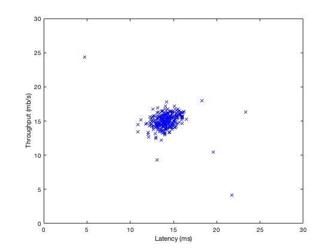
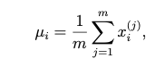
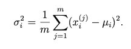
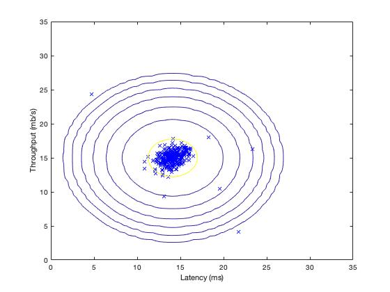
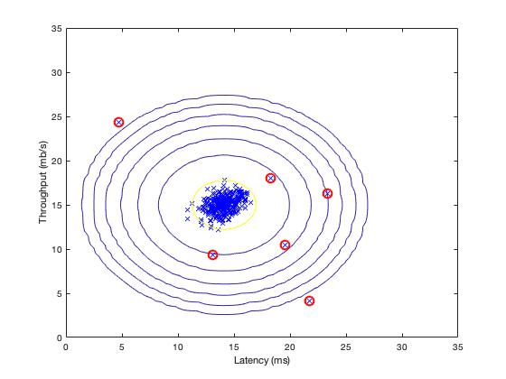
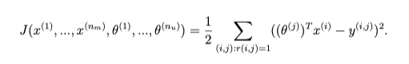
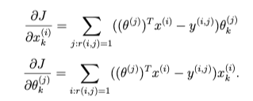

# Machine Learning (MATLAB) - Anomaly Detection and Recommender Systems

Machine Learning course from Stanford University on [Coursera](https://www.coursera.org/learn/machine-learning/home/week/9).

### Introduction
We will implement the anomaly detection algorithm and apply it to detect failing servers on a network. In the second part, we will use collaborative filtering to build a recommender system for movies.

### Environment
- macOS Catalina (version 10.15.3)
- MATLAB 2018 b

### Dataset
- ex8data1.mat
- ex8data2.mat
- ex8_movies.mat

### Files included in this repo
- ex8.m - Octave/MATLAB script for first part of exercise
- ex8_cofi.m - Octave/MATLAB script for second part of exercise 
- ex8data1.mat - First example Dataset for anomaly detection 
- ex8data2.mat - Second example Dataset for anomaly detection
- ex8_movies.mat - Movie Review Dataset
- ex8_movieParams.mat - Parameters provided for debugging 
- multivariateGaussian.m - Computes the probability density function for a Gaussian distribution
- visualizeFit.m - 2D plot of a Gaussian distribution and a dataset 
- checkCostFunction.m - Gradient checking for collaborative filtering 
- computeNumericalGradient.m - Numerically compute gradients
- fmincg.m - Function minimization routine (similar to fminunc) 
- loadMovieList.m - Loads the list of movies into a cell-array
- movie_ids.txt - List of movies
- normalizeRatings.m - Mean normalization for collaborative filtering 
- submit.m - Submission script that sends code to our servers 

[⋆] estimateGaussian.m - Estimate the parameters of a Gaussian distribution with a diagonal covariance matrix

[⋆] selectThreshold.m - Find a threshold for anomaly detection

[⋆] cofiCostFunc.m - Implement the cost function for collaborative filtering  

## Part 1: Anomaly Detection
We will implement an anomaly detection algorithm to detect anomalous behavior in server computers. The features measure the through put (mb/s) and latency (ms) of response of each server. While our servers were operating, we collected m = 307 examples of how they were behaving, and thus have an unlabeled dataset {x(1),...,x(m)}. We suspect that the vast majority of these examples are “normal” (non-anomalous) examples of the servers operating normally, but there might also be some examples of servers acting anomalously within this dataset.

We will use a Gaussian model to detect anomalous examples in dataset.
First start on a 2D dataset that will allow to visualize what the algorithm is doing. On that dataset we will fit a Gaussian distribution and then find values that have very low probability and hence can be considered anomalies. After that, apply the anomaly detection algorithm to a larger dataset with many dimensions.

```
ex8.m
```


- Figure: Visualize first dataset

### Part 1.1: Gaussian Distribution
To perform anomaly detection, we first need to fit a model to the data's distribution.  
The Gaussian distribution:  
    
where, μ is the mean and σ2 controls the variance.

### Part 1.2: Estimating parameters for a Gaussian
we can estimate the parameters, (μi, σi^2), of the i-th feature by using the following equations.
To estimate the mean,   


To estimate the variance,   
  

##### estimateGaussian.m
```
% Estimate the parameters of a Gaussian distribution with a diagonal covariance matrix

function [mu sigma2] = estimateGaussian(X)

% Useful variables
[m, n] = size(X);

% Should return these values correctly
mu = zeros(n, 1);
sigma2 = zeros(n, 1);

mu = 1/m * sum(X,1);
sigma2 = 1/m * sum((X - mu).^2, 1);

end
```


- Figure: The Gaussian distribution contours of the distribution fit to the dataset

We can see that most of the examples are in the region with the highest probability, while
the anomalous examples are in the regions with lower probabilities.

### Part 1.3: Selecting the threshold, ε
As we estimate the Gaussian parameters, we can investigate which examples have a very high probability given this distribution and which examples have a very low probability. The low probability examples are more likely to be the anomalies in our dataset. One way to determine which examples are anomalies is to select a threshold based on a cross validation set.

We will implement an algorithm to select the threshold ε using the F1 score on a cross validation set.

##### selectThreshold.m
```
% Find a threshold for anomaly detection
function [bestEpsilon bestF1] = selectThreshold(yval, pval)

bestEpsilon = 0;
bestF1 = 0;
F1 = 0;

stepsize = (max(pval) - min(pval)) / 1000;

for epsilon = min(pval):stepsize:max(pval)
    
    tp = sum(((pval < epsilon) & (yval == 1))); % true positive
    fp = sum(((pval < epsilon) & (yval == 0))); % false positive
    fn = sum(((pval > epsilon) & (yval == 1))); % false negative
    
    prec = tp/(tp + fp); % precision
    rec = tp/(tp + fn); % recall
    
    F1 = (2*prec*rec)/(prec + rec); % f1 score
    
    if F1 > bestF1
       bestF1 = F1;
       bestEpsilon = epsilon;
    end
end
end
```

  
- Figure: the classified anomalies  

Result:   
Best epsilon found using cross-validation: 8.990853e-05   
Best F1 on Cross Validation Set:  0.875000    


### Part 1.4: High dimensional dataset
Here, we run the anomaly detection algorithm we already implemented on a more realistic and much harder dataset. In this dataset, each example is described by 11 features, capturing many more properties of compute servers.

The script will use code to estimate the Gaussian parameters (μi and σi^2), evaluate the probabilities for both the training data X from which we estimated the Gaussian parameters, and do so for the the cross-validation set Xval.

Result:   
Best epsilon found using cross-validation: 1.377229e-18   
Best F1 on Cross Validation Set:  0.615385  
Outliers (anomalies) found: 117   


## Part 2: Recommender Systems
Here, we implement the collaborative filtering learning algorithm and apply it to a dataset of movie rating. This dataset consists of ratings on a scale of 1 to 5. The dataset has n_u = 943 users, and n_m = 1682 movies.

MATLAB script for this part:
```
ex8_cofi.m
```

We will implement the function *cofiCostFunc.m* that computes the collaborative fitlering objective function and gradient. Thenn fmincg.m to learn the parameters for collaborative filtering.

##### cofiCostFunc.m
The collaborative filtering cost function (without regularization): 


```
% Implement the cost function for collaborative filtering
diff = (X * Theta' - Y);
J = (1/2) * sum(sum(diff .* diff .* R));
```

The gradient of the cost function (without regularization):   
  

```
X_grad = (diff .* R) * Theta;   % unregularized vectorized implementation
Theta_grad = ((diff .* R)' * X); % unregularized vectorized implementation
```


## Course Links 
1) Machine Learning by Stanford University on [Coursera](https://www.coursera.org/learn/machine-learning/home/week/9).

2) [Anomaly Detection and Recommender Systems](https://www.coursera.org/learn/machine-learning/home/week/9)
(Please notice that you need to log in to see the programming assignment.) #ML-Anomaly_Detection_and_Recommender_Systems-MATLAB